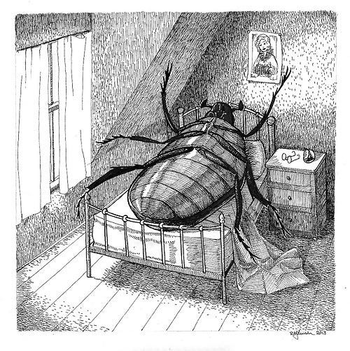

# Kafka Metamorphosis 🪲



_"When Gregor Samsa woke up one morning from unsettling dreams, he found himself changed in his bed into a monstrous vermin."_  
— Franz Kafka, The Metamorphosis

## Overview

Kafka Metamorphosis is a comprehensive Clojure wrapper that transforms the Java Kafka APIs into an elegant, idiomatic Clojure interface. Just as Gregor Samsa underwent his transformation, this library metamorphoses complex Java APIs into simple, functional Clojure code that feels natural and powerful.

## Features

- 🪲 **Idiomatic Clojure API** - Clean, functional interface over Kafka's Java driver
- 📦 **Complete Kafka Support** - Producer, Consumer, and Admin operations
- ⚙️ **Multiple Serialization Formats** - String, JSON, Avro, and Protobuf support
- 🔧 **Configuration Presets** - Pre-built configurations for common use cases
- 🔄 **High-Level & Low-Level APIs** - Choose your level of abstraction
- � **Docker Development Support** - Built-in Docker Compose utilities
- 🆕 **KRaft Mode Support** - Modern Kafka without Zookeeper
- 🛡️ **Error Handling** - Proper exception handling with meaningful messages
- 📊 **Health Checks** - Built-in cluster monitoring and diagnostics

## Installation

Add the following dependency to your `project.clj`:

```clojure
[kafka-metamorphosis "0.1.0-SNAPSHOT"]
```

Or for deps.edn:

```clojure
kafka-metamorphosis {:mvn/version "0.1.0-SNAPSHOT"}
```

## Documentation

📚 **Detailed Guides:**
- [🐳 Docker Setup Guide](docs/DOCKER_SETUP.md) - Complete Docker development environment setup
- [🆕 KRaft Mode Guide](docs/KRAFT_MODE.md) - Modern Kafka without Zookeeper 
- [📋 Topic Creation Guide](docs/TOPIC_CREATION.md) - Comprehensive topic management

## Quick Start

### High-Level API (Recommended)

The simplest way to get started with Kafka Metamorphosis:

```clojure
(require '[kafka-metamorphosis.core :as km])

;; Send a simple message
(km/send-message! "my-topic" "Hello, Kafka!")

;; Send a JSON message
(km/send-json-message! "events" {:user-id 123 :action "login"})

;; Consume messages
(take 10 (km/consume-messages! "my-group" ["my-topic"]))

;; Create a topic
(km/create-topic! "new-topic" {:partitions 6})

;; Check cluster health
(km/health-check)
```

### Using Configuration Presets

```clojure
(require '[kafka-metamorphosis.core :as km]
         '[kafka-metamorphosis.serializers :as serializers])

;; Producer with JSON serialization
(def producer (km/create-producer 
                (km/producer-config {:acks "all"} 
                                    serializers/simple-json-serializers)))

;; Consumer with Avro deserialization
(def consumer (km/create-consumer 
                (km/consumer-config "my-group" {}
                                    (serializers/avro-deserializers "http://schema-registry:8081"))))
```

### Low-Level API

For more control, use the individual namespaces:

```clojure
(require '[kafka-metamorphosis.producer :as producer]
         '[kafka-metamorphosis.consumer :as consumer]
         '[kafka-metamorphosis.admin :as admin])

;; Producer
(def p (producer/create (km/producer-config)))
(producer/send! p "my-topic" "key" "value")
(producer/close! p)

;; Consumer
(def c (consumer/create (km/consumer-config "my-group")))
(consumer/subscribe! c ["my-topic"])
(consumer/poll! c 1000)
(consumer/close! c)

;; Admin operations
(def a (admin/create-admin-client (km/admin-config)))
(admin/create-topic! a "new-topic" {:partitions 3})
(admin/list-topics a)
(admin/close! a)
```

## Command Line Interface

Kafka Metamorphosis includes a CLI for quick operations:

```bash
# Check cluster health
lein run health

# List topics
lein run topics

# Send a message
lein run send my-topic "Hello, World!"

# Send JSON message
lein run send-json events '{"user": "john", "action": "login"}'
```

## Serialization Support

Multiple serialization formats are supported out of the box:

```clojure
(require '[kafka-metamorphosis.serializers :as serializers])

;; String serialization (default)
serializers/string-serializers
serializers/string-deserializers

;; Simple JSON (no schema registry)
serializers/simple-json-serializers
serializers/simple-json-deserializers

;; Confluent JSON with Schema Registry
serializers/json-serializers
serializers/json-deserializers

;; Avro with Schema Registry
(serializers/avro-serializers "http://schema-registry:8081")
(serializers/avro-deserializers "http://schema-registry:8081")

;; Protobuf with Schema Registry
(serializers/protobuf-serializers "http://schema-registry:8081")
(serializers/protobuf-deserializers "http://schema-registry:8081")
```

## Development Environment

### Docker Setup (Recommended)

The easiest way to get started is using the built-in Docker development environment:

```clojure
(require '[kafka-metamorphosis.dev :as dev])

;; KRaft mode (modern, no Zookeeper)
(dev/kafka-setup-kraft!)

;; Traditional mode with Zookeeper
(dev/kafka-setup-zookeeper!)

;; Schema Registry + Kafka + UI
(dev/kafka-setup-full!)
```

See the [Docker Setup Guide](docs/DOCKER_SETUP.md) for detailed instructions.

### Local Development

```bash
# Start REPL
lein repl

# Run tests
lein test

# Build
lein uberjar

# Health check
lein run health
```

## Configuration

Kafka Metamorphosis uses Clojure maps for configuration, automatically converting them to Java Properties. All standard Kafka configuration options are supported:

```clojure
;; Producer configuration
(km/producer-config "localhost:9092" 
                    {:acks "all"
                     :retries 3
                     :batch-size 16384
                     :linger-ms 1}
                    serializers/json-serializers)

;; Consumer configuration  
(km/consumer-config "localhost:9092"
                    "my-group"
                    {:auto-offset-reset "earliest"
                     :enable-auto-commit true}
                    serializers/json-deserializers)
```

## API Reference

### Core Namespace

The main entry point with high-level convenience functions:

```clojure
(require '[kafka-metamorphosis.core :as km])

;; Configuration builders
(km/producer-config)
(km/consumer-config "group-id")
(km/admin-config)

;; High-level messaging
(km/send-message! "topic" "value")
(km/send-json-message! "topic" {:data "value"})
(km/consume-messages! "group" ["topic1" "topic2"])
(km/consume-json-messages! "group" ["topic"])

;; Admin operations
(km/create-topic! "topic" {:partitions 6})
(km/list-topics)
(km/topic-exists? "topic")
(km/health-check)
```

### Serializers Namespace

Serialization configurations for different data formats:

```clojure
(require '[kafka-metamorphosis.serializers :as ser])

;; Available serializers
ser/string-serializers
ser/simple-json-serializers
ser/json-serializers
(ser/avro-serializers "schema-registry-url")
(ser/protobuf-serializers "schema-registry-url")

;; JSON utilities
(ser/to-json {:key "value"})
(ser/from-json "{\"key\":\"value\"}")
```

### Individual Namespaces

For fine-grained control:

```clojure
;; Producer operations
(require '[kafka-metamorphosis.producer :as producer])
(producer/create config)
(producer/send! producer topic key value)
(producer/close! producer)

;; Consumer operations  
(require '[kafka-metamorphosis.consumer :as consumer])
(consumer/create config)
(consumer/subscribe! consumer topics)
(consumer/poll! consumer timeout)
(consumer/close! consumer)

;; Admin operations
(require '[kafka-metamorphosis.admin :as admin])
(admin/create-admin-client config)
(admin/create-topic! client topic-name opts)
(admin/list-topics client)
(admin/close! client)
```

## Examples

### JSON Event Processing

```clojure
(require '[kafka-metamorphosis.core :as km])

;; Send events
(km/send-json-message! "user-events" 
                       {:user-id 123 
                        :action "login" 
                        :timestamp (System/currentTimeMillis)})

;; Process events
(doseq [message (take 100 (km/consume-json-messages "processors" ["user-events"]))]
  (let [event (:value message)]
    (println "Processing event for user" (:user-id event))))
```

### Multi-Topic Consumer

```clojure
;; Consume from multiple topics with custom processing
(let [messages (km/consume-messages "analytics" 
                                    ["page-views" "clicks" "purchases"]
                                    {:max-messages 1000 :timeout-ms 5000})]
  (doseq [msg messages]
    (case (:topic msg)
      "page-views" (process-page-view msg)
      "clicks" (process-click msg)  
      "purchases" (process-purchase msg))))
```

## Contributing

1. Fork the repository
2. Create a feature branch (`git checkout -b feature/amazing-feature`)
3. Make your changes
4. Add tests for your changes
5. Run the test suite (`lein test`)
6. Submit a pull request

### Development Guidelines

- Follow Clojure style conventions
- Add docstrings to public functions
- Include tests for new functionality
- Update documentation for API changes
- Use meaningful commit messages

## Roadmap

- [x] ✅ **Core Producer/Consumer/Admin APIs**
- [x] ✅ **Multiple Serialization Formats** (String, JSON, Avro, Protobuf)
- [x] ✅ **High-Level Convenience Functions**
- [x] ✅ **Docker Development Environment**
- [x] ✅ **KRaft Mode Support**
- [x] ✅ **Health Checks and Monitoring**
- [ ] 🔄 **Kafka Streams Wrapper**
- [ ] 🔄 **Transaction Support**
- [ ] 🔄 **Metrics Integration**
- [ ] 🔄 **Schema Evolution Support**
- [ ] 🔄 **Dead Letter Queue Patterns**
- [ ] 🔄 **Backpressure Handling**

## Architecture

Kafka Metamorphosis is organized into focused namespaces:

```
kafka-metamorphosis/
├── core           # High-level API and convenience functions
├── producer       # Producer operations and configuration  
├── consumer       # Consumer operations and configuration
├── admin          # Administrative operations
├── serializers    # Serialization/deserialization configs
└── dev            # Development utilities and Docker setup
```

### Design Philosophy

- **🎯 Simplicity First** - Complex operations should be simple to use
- **🔧 Flexibility When Needed** - Power users can access low-level APIs
- **📦 Batteries Included** - Common patterns work out of the box
- **🪲 Idiomatic Clojure** - Functions, maps, and lazy sequences
- **⚡ Performance Conscious** - Minimal overhead over Java driver

## Inspiration

This project draws inspiration from Franz Kafka's "The Metamorphosis," where the protagonist undergoes a dramatic transformation. Similarly, this library transforms the Java Kafka API into something more suitable for the Clojure ecosystem - a metamorphosis from imperative to functional, from complex to simple, from verbose to elegant.

## Related Projects

- [Apache Kafka](https://kafka.apache.org/) - The underlying streaming platform
- [jackdaw](https://github.com/FundingCircle/jackdaw) - Another Clojure Kafka library with Kafka Streams support
- [clj-kafka](https://github.com/pingles/clj-kafka) - Alternative Clojure Kafka client
- [franzy](https://github.com/ymilky/franzy) - Comprehensive Kafka toolkit for Clojure

## License

Copyright © 2025 Kafka Metamorphosis Contributors

This program and the accompanying materials are made available under the
terms of the Eclipse Public License 2.0 which is available at
http://www.eclipse.org/legal/epl-2.0.

This Source Code may also be made available under the following Secondary
Licenses when the conditions for such availability set forth in the Eclipse
Public License, v. 2.0 are satisfied: GNU General Public License as published by
the Free Software Foundation, either version 2 of the License, or (at your
option) any later version, with the GNU Classpath Exception which is available
at https://www.gnu.org/software/classpath/license.html.

---

**The metamorphosis is complete! 🦋**

_Transform your Kafka experience with the elegance of Clojure._
